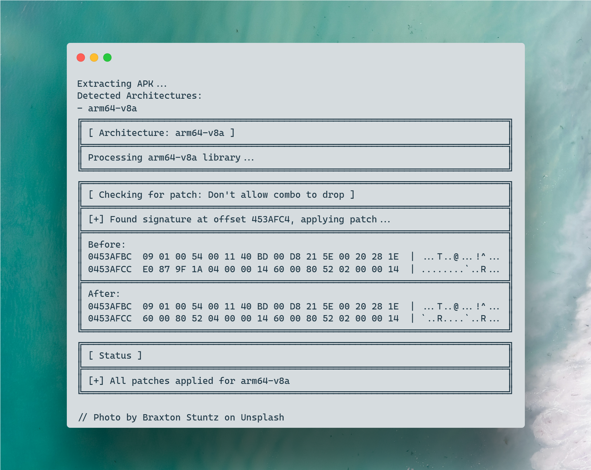
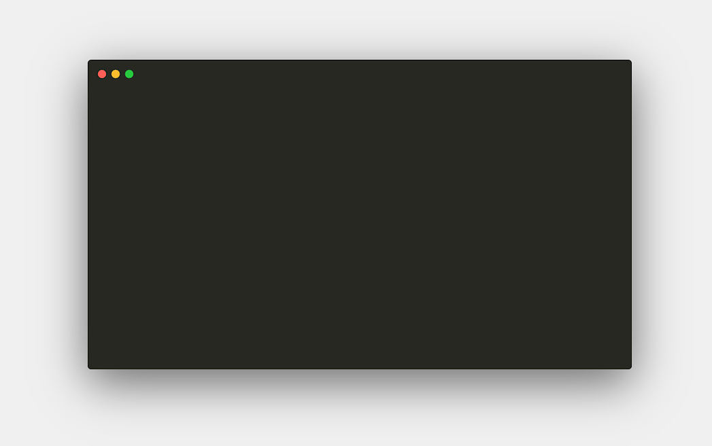

# IL2Patch



## Overview

IL2Patch is a specialized tool designed to modify IL2CPP-based Unity Android applications. By directly patching the `libil2cpp.so` library, IL2Patch enables precise manipulation of game logic and behavior through hex pattern matching and replacement.

## 🛠️ Key Features

- **Multi-Architecture Support:** Compatible with `arm64-v8a`, `armeabi-v7a`, `x86`, and `x86_64` architectures.
- **Automated APK Handling:** Streamlines the process of unpacking, patching, and repacking APK files.
- **Zipalign Optimization:** Ensures optimal APK alignment for enhanced performance.
- **APK Signing:** Includes integrated APK signing for immediate installation on Android devices.
- **Detailed Debug Logging:** Provides comprehensive logs for easy troubleshooting and patch verification.


## ⚙️ How It Works

IL2CPP (Intermediate Language to C++) is a Unity scripting backend that transforms C\# code into native machine code. This enhances performance and security, but also complicates game modification. With IL2CPP, core gameplay logic is compiled into the `libil2cpp.so` binary, necessitating direct binary-level modifications.

IL2Patch automates the entire patching process, making IL2CPP modifications faster and more reliable.



The patching process can be broken down into these key steps:

1. **Extraction:** The target APK is extracted, and the `libil2cpp.so` library is located.
2. **Modification:** Relevant hex patterns within the `libil2cpp.so` file are identified and modified according to user-defined patches.
3. **Repackaging:** The modified files are recompressed and packaged back into a new APK.
4. **Optimization:** The recompiled APK is optimized using Zipalign.
5. **Signing:** The final APK is signed with a keystore for installation.

## 🚀 Getting Started

### Prerequisites

* Ensure you have the Android SDK installed. IL2Patch will prompt you for the location on the first run.
* Familiarize yourself with hex editing concepts.


### Setup Steps

1. **APK Placement:** Place the target APK file in the IL2Patch directory.
2. **Patch Definition:** Create a `patch.xml` file that defines the modifications you wish to apply.
3. **Execution:** Run IL2Patch. The tool will guide you through the automated patching process.
4. **Output:** Retrieve the modified APK file (either `signed.apk` or `aligned.apk`) from the output directory.

### Initial Configuration

Upon the first execution, IL2Patch will prompt you for:

* Location of the Android SDK.
* Preferred version of the Build Tools.
* Preferences for Zipalign and APK signing.

These settings are stored in `config.xml` for future sessions.

## 🔑 Keystore Management

### Debug Keystore

A debug keystore is included in the `keystore` folder for testing purposes:

* `debug.keystore`
* `password.txt` (contains the password: `android`)


### Production Keystore

For production releases, it is highly recommended to generate your own keystore using the following command:

```bash
keytool -genkey -v -keystore android.keystore -alias android -keyalg RSA -keysize 2048 -validity 10000
```


## 📝 Patch Format: `patch.xml`

Patches are defined in an XML format, allowing for structured and organized modifications.

### XML Structure

All patches must be enclosed within the `<Patches>` root element:

```xml
<?xml version="1.0" encoding="UTF-8"?>
<Patches>
    <!-- Patches go here -->
</Patches>
```


### Patch Definition

Each `<Patch>` element represents a single modification and requires the `arch` attribute to specify the target architecture.

```xml
<Patch arch="arm64-v8a">
    <Description>No Recoil</Description>
    <Find>1f2003d5202640b9</Find>
    <Replace>1f2003d51f2003d5</Replace>
</Patch>
```


### Example Patches

```xml
<?xml version="1.0" encoding="UTF-8"?>
<Patches>
    <Patch arch="arm64-v8a">
        <Description>No Recoil</Description>
        <Find>1f2003d5202640b9</Find>
        <Replace>1f2003d51f2003d5</Replace>
    </Patch>
    <Patch arch="arm64-v8a">
        <Description>Rapid Fire</Description>
        <Find>00009f1a60008052</Find>
        <Replace>00009f1a20008052</Replace>
    </Patch>
    <Patch arch="arm64-v8a">
        <Description>Infinite Ammo</Description>
        <Find>1f2003d5400080d2</Find>
        <Replace>1f2003d5200080d2</Replace>
    </Patch>
</Patches>
```


### Supported Hex Formats

The `Find` and `Replace` elements support multiple hex formats:

1. **Continuous Hex String:** `600080520200001440008052`
2. **Space-Separated Hex Values:** `00 d8 21 5e 00 20 28 1e 60 00 80 52`
3. **Hex Values with `0x` Prefix:** `0x00 0xd8 0x21 0x5e 0x00 0x20 0x28 0x1e 0x60 0x00 0x80 0x52`
4. **Comma-Separated Hex Values with `0x` Prefix:** `0x00, 0xd8, 0x21, 0x5e, 0x00, 0x20, 0x28, 0x1e, 0x60, 0x00, 0x80, 0x52`

## ⚠️ Disclaimer

IL2Patch is provided for educational and research purposes only. Users are solely responsible for compliance with applicable terms of service and local regulations. The developers of IL2Patch assume no liability for misuse of this tool.

<div style="text-align: center">⁂</div>
